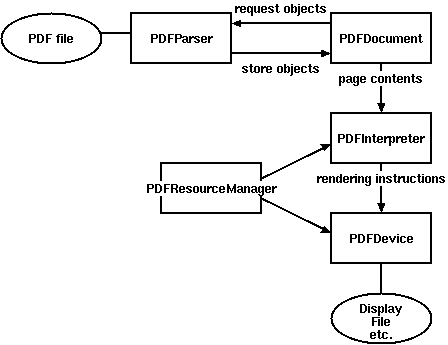
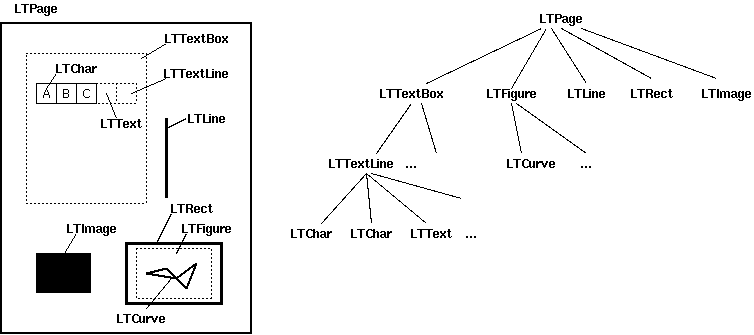

`[Back to PDFMiner] <#pdfminer_index.rst>`_

Programming with PDFMiner
=========================

This page explains how to use PDFMiner as a library from other
applications.

Overview
---------------

**PDF is evil.** Although it is called a PDF "document", it's nothing
like Word or HTML document. PDF is more like a graphic representation.
PDF contents are just a bunch of instructions that tell how to place the
stuff at each exact position on a display or paper. In most cases, it
has no logical structure such as sentences or paragraphs and it cannot
adapt itself when the paper size changes. PDFMiner attempts to
reconstruct some of those structures by guessing from its positioning,
but there's nothing guaranteed to work. Ugly, I know. Again, PDF is
evil.

[More technical details about the internal structure of PDF: "How to
Extract Text Contents from PDF Manually" `(part
1) <http://www.youtube.com/watch?v=k34wRxaxA_c>`_ `(part
2) <http://www.youtube.com/watch?v=_A1M4OdNsiQ>`_ `(part
3) <http://www.youtube.com/watch?v=sfV_7cWPgZE>`_]

Because a PDF file has such a big and complex structure, parsing a PDF
file as a whole is time and memory consuming. However, not every part is
needed for most PDF processing tasks. Therefore PDFMiner takes a
strategy of lazy parsing, which is to parse the stuff only when it's
necessary. To parse PDF files, you need to use at least two classes:
``PDFParser`` and ``PDFDocument``. These two objects are associated with
each other. ``PDFParser`` fetches data from a file, and ``PDFDocument``
stores it. You'll also need ``PDFPageInterpreter`` to process the page
contents and ``PDFDevice`` to translate it to whatever you need.
``PDFResourceManager`` is used to store shared resources such as fonts
or images.

Figure 1 shows the relationship between the classes in PDFMiner.

.. raw:: html

   

|image0|
Figure 1. Relationships between PDFMiner classes

.. raw:: html

   

Basic Usage
------------------

A typical way to parse a PDF file is the following:

    ::

        from pdfminer.pdfparser import PDFParser
        from pdfminer.pdfdocument import PDFDocument
        from pdfminer.pdfpage import PDFPage
        from pdfminer.pdfpage import PDFTextExtractionNotAllowed
        from pdfminer.pdfinterp import PDFResourceManager
        from pdfminer.pdfinterp import PDFPageInterpreter
        from pdfminer.pdfdevice import PDFDevice

        # Open a PDF file.
        fp = open('mypdf.pdf', 'rb')
        # Create a PDF parser object associated with the file object.
        parser = PDFParser(fp)
        # Create a PDF document object that stores the document structure.
        # Supply the password for initialization.
        document = PDFDocument(parser, password)
        # Check if the document allows text extraction. If not, abort.
        if not document.is_extractable:
            raise PDFTextExtractionNotAllowed
        # Create a PDF resource manager object that stores shared resources.
        rsrcmgr = PDFResourceManager()
        # Create a PDF device object.
        device = PDFDevice(rsrcmgr)
        # Create a PDF interpreter object.
        interpreter = PDFPageInterpreter(rsrcmgr, device)
        # Process each page contained in the document.
        for page in PDFPage.create_pages(document):
            interpreter.process_page(page)

Performing Layout Analysis
---------------------------------

Here is a typical way to use the layout analysis function:

    ::

        from pdfminer.layout import LAParams
        from pdfminer.converter import PDFPageAggregator

        # Set parameters for analysis.
        laparams = LAParams()
        # Create a PDF page aggregator object.
        device = PDFPageAggregator(rsrcmgr, laparams=laparams)
        interpreter = PDFPageInterpreter(rsrcmgr, device)
        for page in PDFPage.create_pages(document):
            interpreter.process_page(page)
            # receive the LTPage object for the page.
            layout = device.get_result()

A layout analyzer returns a ``LTPage`` object for each page in the PDF
document. This object contains child objects within the page, forming a
tree structure. Figure 2 shows the relationship between these objects.

.. raw:: html

   

|image1|
Figure 2. Layout objects and its tree structure

.. raw:: html

   

``LTPage``

Represents an entire page. May contain child objects like ``LTTextBox``,
``LTFigure``, ``LTImage``, ``LTRect``, ``LTCurve`` and ``LTLine``.

``LTTextBox``

Represents a group of text chunks that can be contained in a rectangular
area. Note that this box is created by geometric analysis and does not
necessarily represents a logical boundary of the text. It contains a
list of ``LTTextLine`` objects. ``get_text()`` method returns the text
content.

``LTTextLine``

Contains a list of ``LTChar`` objects that represent a single text line.
The characters are aligned either horizontaly or vertically, depending
on the text's writing mode. ``get_text()`` method returns the text
content.

``LTChar``

``LTAnno``

Represent an actual letter in the text as a Unicode string. Note that,
while a ``LTChar`` object has actual boundaries, ``LTAnno`` objects does
not, as these are "virtual" characters, inserted by a layout analyzer
according to the relationship between two characters (e.g. a space).

``LTFigure``

Represents an area used by PDF Form objects. PDF Forms can be used to
present figures or pictures by embedding yet another PDF document within
a page. Note that ``LTFigure`` objects can appear recursively.

``LTImage``

Represents an image object. Embedded images can be in JPEG or other
formats, but currently PDFMiner does not pay much attention to graphical
objects.

``LTLine``

Represents a single straight line. Could be used for separating text or
figures.

``LTRect``

Represents a rectangle. Could be used for framing another pictures or
figures.

``LTCurve``

Represents a generic Bezier curve.

Also, check out `a more complete example by Denis
Papathanasiou <http://denis.papathanasiou.org/?p=343>`_.

Obtaining Table of Contents
----------------------------------

PDFMiner provides functions to access the document's table of contents
("Outlines").

    ::

        from pdfminer.pdfparser import PDFParser
        from pdfminer.pdfdocument import PDFDocument

        # Open a PDF document.
        fp = open('mypdf.pdf', 'rb')
        parser = PDFParser(fp)
        document = PDFDocument(parser, password)

        # Get the outlines of the document.
        outlines = document.get_outlines()
        for (level,title,dest,a,se) in outlines:
            print (level, title)

Some PDF documents use page numbers as destinations, while others use
page numbers and the physical location within the page. Since PDF does
not have a logical structure, and it does not provide a way to refer to
any in-page object from the outside, there's no way to tell exactly
which part of text these destinations are referring to.

Extending Functionality
------------------------------

You can extend ``PDFPageInterpreter`` and ``PDFDevice`` class in order
to process them differently / obtain other information.

--------------

Yusuke Shinyama

